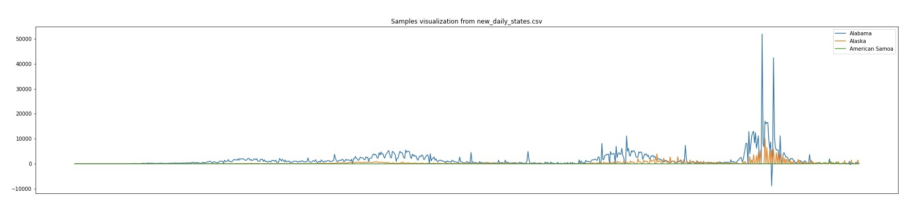
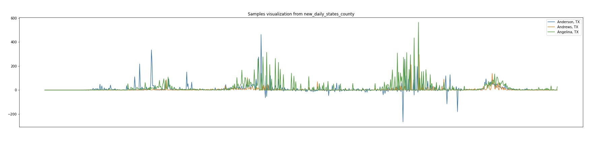
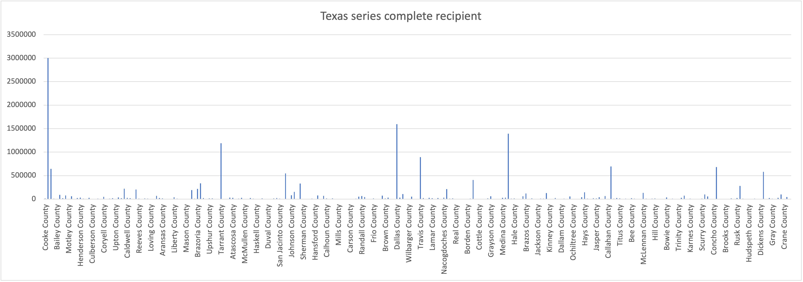
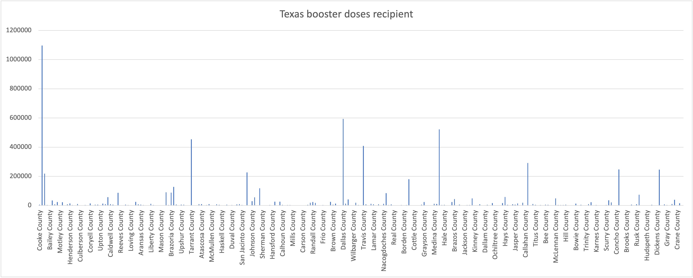

# COMP590-Data-Processing
## 1. Confirmed Cases Data Processing
### 1.1 Project Introduction
This is a project that collects COVID-19 confirmed cases data from [COVID-19 Data Repository by the Center for Systems Science and Engineering (CSSE) at Johns Hopkins University](https://github.com/CSSEGISandData/COVID-19) 
and process the data (originally cumulative) into the desired format (daily increment) 
that is need by the COMP590 frontend and backend team. This project contains the usage of 
[Google Colab](https://colab.research.google.com/), [Python3](https://www.python.org/) 
and [pandas library](https://pandas.pydata.org/).

### 1.2 Database
Our database provider is the [JHU CSSE COVID-19 Data](https://github.com/CSSEGISandData/COVID-19) 
and the main dataset we use for this project is the [CSSE COVID-19 Time series data](https://github.com/CSSEGISandData/COVID-19/blob/master/csse_covid_19_data/csse_covid_19_time_series/time_series_covid19_confirmed_US.csv)
(time_series_covid19_confirmed_US.csv). This file is 11.7MB and contains cumulative confirmed 
cases data of all 3343 counties in all 58 states and territories of the United States. Specifically, 
the time range of this dataset is from 01/22/20 to current.

### 1.3 Detailed Workflow
To get started with our data processing, we firstly downloaded the dataset using pandas then directly 
converted the dataset into a pandas dataframe. Since that the original data is in cumulative form, and we 
desired the daily form, we subtracted one day's data with the day before it to get the daily increment. 
And we save that into [daily_cases/new_daily.csv](https://github.com/NUMBKV/COMP590-Data-Processing/blob/2f3621c39b0d5599fa7ba75eee4e8fb67c5e4a4d/daily_cases/new_daily_all.csv).

Then, based on our backend team's demands, we sum the counties' daily data by state to show every states' daily 
confirmed cases and save the aggregation result into [daily_cases/new_daily_states.csv](https://github.com/NUMBKV/COMP590-Data-Processing/blob/2f3621c39b0d5599fa7ba75eee4e8fb67c5e4a4d/daily_cases/new_daily_states.csv). 
Below is a plot of a sample visualization of this result (the below zero value is due to statistical error).


Finally, to ease the backend load and accelerate our website's performance, we separate the counties' that belongs to the same state/territory and then 
aggregate them into a csv file called confirmed_cases_statename.csv. 
All these saved file are in [daily_cases/new_daily_states_county](https://github.com/NUMBKV/COMP590-Data-Processing/blob/2f3621c39b0d5599fa7ba75eee4e8fb67c5e4a4d/daily_cases/new_daily_states_county).
Below is a plot of a sample visualization of this result (the below zero value is due to statistical error).


## 2. Vaccination Data Processing
### 2.1 Project Introduction
The goal of the Vaccination Data Processing project is to crawl data from [Centers for Disease Control and Prevention](https://www.cdc.gov/)
and process data to the demanded format.
We mainly want the vaccination completeness percentage, first dose, series dose,
and booster dose completeness percentage. Therefore, We retrieved these columns from the data we crawled from CDC.
We produce vaccination CSV down to county level by state. (e.g., vaccination_data_Texas.csv) which can be used for the front-end and back-end team in the future. We leverage Web crawling with Python to complete this project.
The Tech-stack in our project includes [Python3](https://www.python.org/), [Pandas Library](https://pandas.pydata.org/),
[Sodapy Library](https://pypi.org/project/sodapy/0.1.4/), and [Python Requests Module](https://docs.python-requests.org/).
Our notebook is [vaccination_data_processing.ipynb](https://github.com/NUMBKV/COMP590-Data-Processing/blob/main/vaccination/vaccination_data_processing.ipynb) and run on [Google Colab](https://colab.research.google.com/).


### 2.2 Database and Data Retrieval
Our database provider is the [Centers for Disease Control and Prevention](https://www.cdc.gov/)
and the vaccination dataset we use for this project is from [Centers for Disease Control and Prevention](https://data.cdc.gov/Vaccinations/COVID-19-Vaccinations-in-the-United-States-County/8xkx-amqh).
CDC has the most dated vaccination dataset. The vaccination data has all 3343 counties in all 58 states and territories of the United States.
We did the data retrieval from the website, and we retrieved the column we needed to format our CSV data.
The columns in the CSV are date, state, county, completeness percentage, the first dose, series dose, and the booster dose.


### 2.3 Detailed Workflow
The steps in our vaccination data processing are as below. To implement web crawling using Python, 
we exploited the request module and sodapy to crawl data from the CDC website.
```python
# Unauthenticated client only works with public data sets. Note 'None'
# in place of application token, and no username or password:
client = Socrata("data.cdc.gov", None)

# Returned as JSON from API / converted to Python list of dictionaries by sodapy.
results = client.get_all("8xkx-amqh", date='2022-04-28')
```
We use Socrata to connect to data.cdc.gov Open Data, then get all the vaccination data.
Since our goal is to format data by state level, we want to output each state's vaccination data.
Hence, we use python to process data to store data in a dictionary, the key is each state, and the value is the state's vaccination data.
Then, we loop through the dictionary, and we create a pandas data frame and
this will be our output CSV format, send data to pandas,
then append each record to the pandas dataframe.
```python
df = pd.DataFrame(columns=['date', 'recip_state', 'recip_county', 'completeness_pct', 'administered_dose1_recip', 'series_complete_yes', 'booster_doses'])
```
Finally, we could output the CSV of each state. All the state's vaccination data are in this directory:
[vaccination_data_county](https://github.com/NUMBKV/COMP590-Data-Processing/tree/main/vaccination/vaccination_data_county).
We output a CSV with all state data: [vaccination_data_all.csv](https://github.com/NUMBKV/COMP590-Data-Processing/blob/main/vaccination/vaccination_data_all.csv).
Below is a plot of a sample visualization of our vaccination result.

Texas Series Complete Recipient by County Level at 04/29/2022:



Texas Booster Dose Recipient by County Level at 04/29/2022:



Note: By changing below date field value in our notebook, we could get the most dated vaccination data.
```python
results = client.get_all("8xkx-amqh", date='2022-04-28')
```

## Our team members
Hsuan-Ling Lin([hl94@rice.edu](mailto:hl94@rice.edu)), Liming Yao([ly38@rice.edu](mailto:ly38@rice.edu)), Yuhua Chen([yc143@rice.edu](mailto:yc143@rice.edu)), Kaiwen Deng([kd45@rice.edu](mailto:kd45@rice.edu)), Jing Gao([jg107@rice.edu](mailto:jg107@rice.edu))
